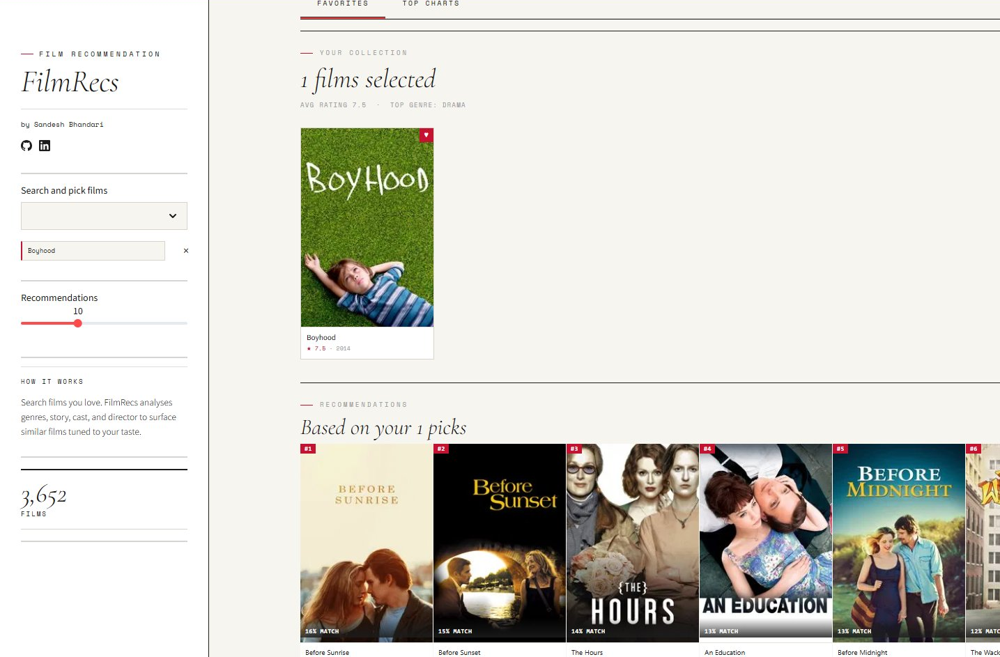
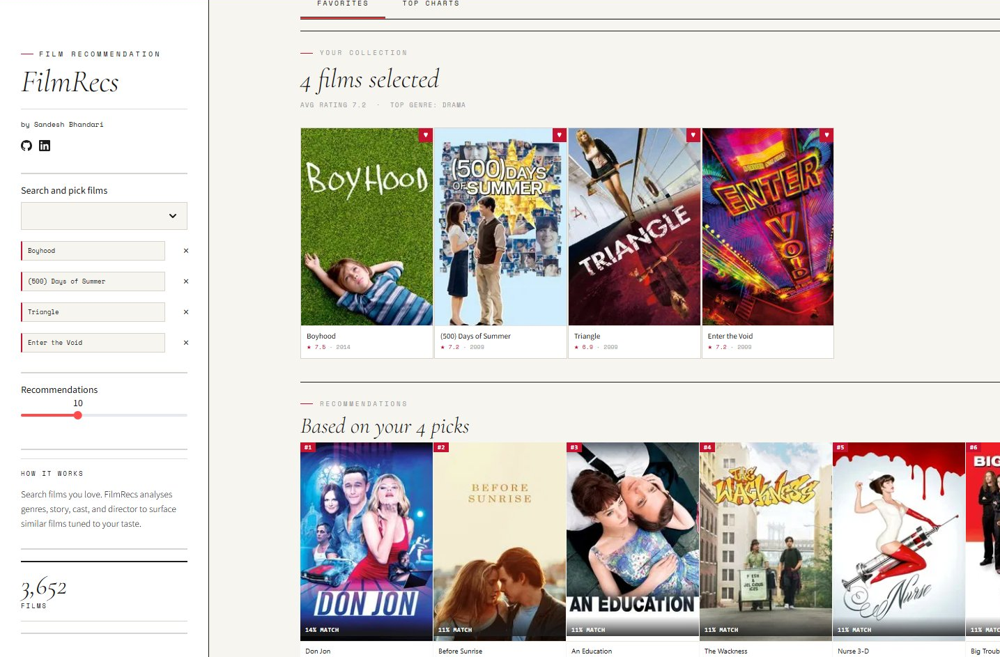
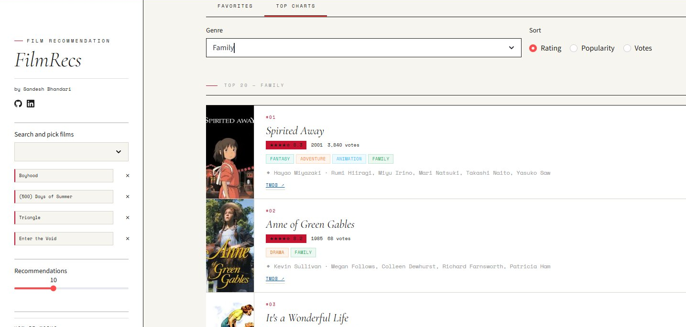

# FilmRecs

A content-based film recommendation engine built with Python and Streamlit. Pick one film or build a collection of favourites, and FilmRecs surfaces similar films tuned to your taste by analysing genre, story, cast, director, and keywords.

---

## Demo

### Pick a single film, get instant recommendations

Search for a film in the sidebar and FilmRecs immediately returns the closest matches. Selecting Boyhood surfaces films like Before Sunrise, Before Sunset, The Hours, and An Education.



### The more films you add, the smarter it gets

Add multiple films and FilmRecs averages your full taste profile to find recommendations that span your entire collection. With Boyhood, (500) Days of Summer, Triangle, and Enter the Void selected, the engine identifies overlapping themes across all four and returns a richer, more tuned set of results.



### Top Charts: browse by genre and sort

Switch to the Top Charts tab to browse the highest-rated films across any genre. Filter by Action, Adventure, Animation, Comedy, Crime, Documentary, Family, and more. Sort by Rating, Popularity, or Votes.



---

## How It Works

FilmRecs uses content-based filtering. It does not rely on collaborative user ratings. Instead it analyses what each film is actually about.

For every film in the dataset, it builds a text document combining genres, keywords, plot overview, cast, and director. These documents are then transformed into numerical vectors using TF-IDF (Term Frequency-Inverse Document Frequency), which weights rare and distinctive terms more heavily than common ones.

When you select films, the engine computes the average of their TF-IDF vectors to build a single taste profile. It then computes cosine similarity between your profile and every other film in the dataset, ranking results by closeness of match.

The more films you add, the more refined the average becomes, nudging the profile toward the specific combination of genres, themes, and creative voices that define your taste.

---

## Files

```
streamlit_app.py             main application including UI, recommendation logic, and rendering
tmdb_5000_movies.csv         TMDB movie metadata (title, genres, keywords, overview, ratings)
tmdb_5000_credits_slim.csv   cast and director data joined to the movie dataset
requirements.txt             Python dependencies
Dockerfile                   container config for deployment
```

---

## Stack

* Python (core logic and data processing)
* scikit-learn (TF-IDF vectorisation and cosine similarity)
* pandas and numpy (data loading and manipulation)
* Streamlit (UI framework and deployment)
* TMDB API (optional movie poster fetching, requires a free API key)
* Hugging Face Spaces (hosting)

---

## Dataset

The app uses the TMDB 5000 Movie Dataset, filtered to films with at least 50 votes, giving a working library of 3,652 films. Genre lists, keywords, cast, and director fields are parsed from JSON and combined into the content model at startup.

---

## What to Expect

Results are strongest when your selected films share clear thematic or stylistic overlap. Mixing very different genres will produce averaged recommendations somewhere in between. Adding more films generally improves precision since the engine has more signal to work with.

---

Built by [Sandesh Bhandari](https://github.com/sandesh-bhandari-dev)
